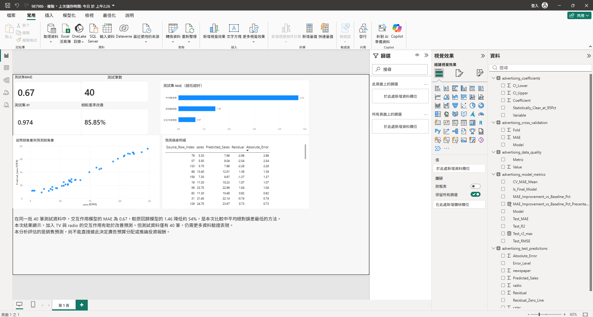
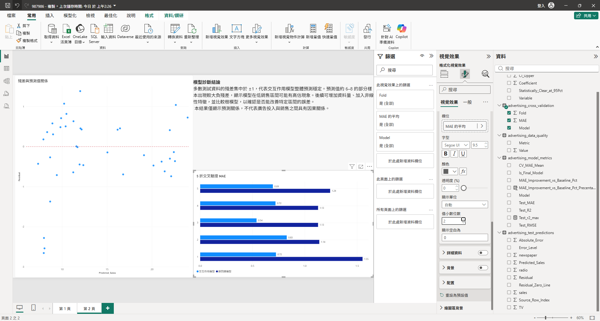

# 廣告投放與銷售預測分析

以公開 Advertising 資料集模擬商業分析流程：從資料品質檢查、假設建立、模型比較與驗證，到 Power BI 儀表板與商業解讀。

## 專案目標

- 分析 TV、radio、newspaper 廣告投入與 sales 的關聯。
- 比較中位數基準、加法線性回歸與 `TV × radio` 交互作用模型。
- 使用獨立測試集與 5 折交叉驗證，避免只用訓練資料判斷模型成效。
- 將模型結果轉化為清楚的 Power BI 儀表板、商業洞察與限制說明。

## 關鍵結果

| 方法 | 測試集 MAE | 測試集 R² | 5 折平均 MAE |
|---|---:|---:|---:|
| 中位數基準 | 4.748 | -0.008 | — |
| 原回歸模型 | 1.461 | 0.899 | 1.237 |
| 交互作用模型 | **0.672** | **0.974** | **0.701** |

- 最終交互作用模型相較中位數基準，測試集 MAE 改善 **85.85%**。
- 相較原回歸模型，測試集 MAE 約下降 **54%**。
- 交互作用模型在全部 5 折驗證中皆低於原回歸模型，改善具有跨分組一致性。
- 殘差大多集中於 ±1；低銷售預測區間仍出現數筆較大的負殘差，顯示模型可能在該區間高估。

## Power BI 儀表板

完整互動式報表請使用 Power BI Desktop 開啟 `powerbi/advertising_sales_dashboard.pbix`。

### 模型成效總覽



### 模型診斷



## 分析流程

1. 檢查資料型態、缺失值、重複紀錄與合理範圍。
2. 建立中位數預測基準。
3. 建立加法線性回歸：`sales ~ TV + radio + newspaper`。
4. 建立交互作用模型：`sales ~ TV * radio + newspaper`。
5. 使用固定隨機種子的 80/20 訓練測試切分。
6. 在訓練集執行 5 折交叉驗證，再以保留測試集做最終評估。
7. 檢視實際值與預測值、殘差分布及高誤差樣本。
8. 匯出 Power BI 所需資料表並製作互動式儀表板。

## 商業解讀與限制

加入 TV 與 radio 的交互作用後，模型預測明顯改善，表示兩種媒體投入的組合關係值得進一步驗證。不過，此公開資料集僅有 200 筆觀測值，且未包含價格、促銷、季節與區域等可能影響銷售的因素。本分析描述的是預測關係，不能直接推論廣告投入的因果效果或據此決定預算分配。

若要支援真實預算決策，後續應蒐集更多期間與市場資料，加入成本與 ROI 指標，並透過隨機實驗、準實驗或行銷組合模型驗證增量效果。

## 技術工具

- Python、Pandas、NumPy
- Statsmodels、Scikit-learn
- Matplotlib
- Power BI、Power Query

## 執行方式

```bash
pip install -r requirements.txt
python advertising_portfolio.py
```

程式會從公開網址讀取資料，並將模型指標、測試集預測、交叉驗證、係數與資料品質摘要輸出至 `outputs/`。

## 專案結構

```text
advertising-sales-analytics/
├── advertising_portfolio.py
├── requirements.txt
├── README.md
├── powerbi/
│   └── advertising_sales_dashboard.pbix
├── docs/
│   ├── dashboard_overview.png
│   └── model_diagnostics.png
└── outputs/
    ├── advertising_model_metrics.csv
    ├── advertising_test_predictions.csv
    ├── advertising_cross_validation.csv
    ├── advertising_coefficients.csv
    ├── advertising_data_quality.csv
    └── *.png
```

## 資料來源

Advertising dataset，由程式中的公開 GitHub CSV 網址讀取。本專案僅供學習與作品集展示。
